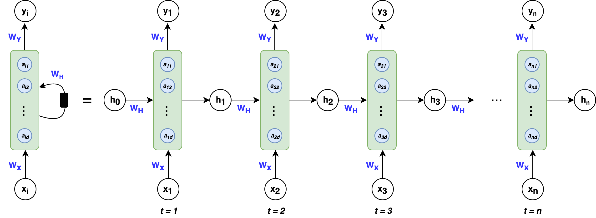
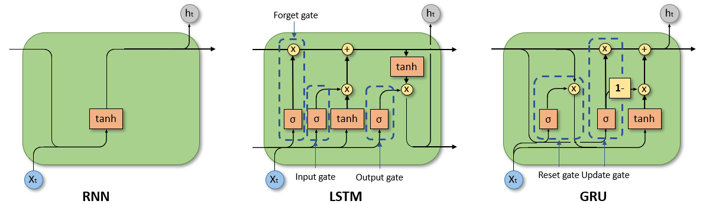
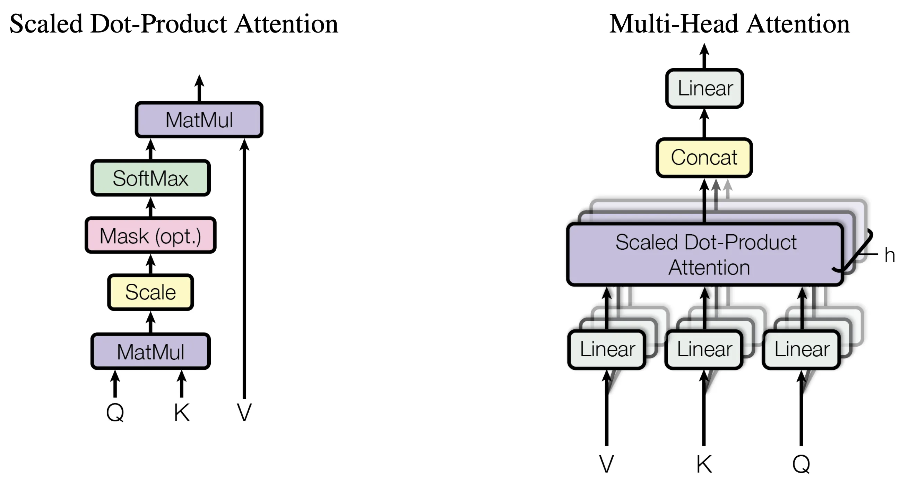
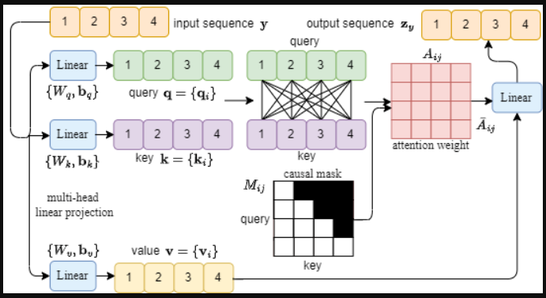
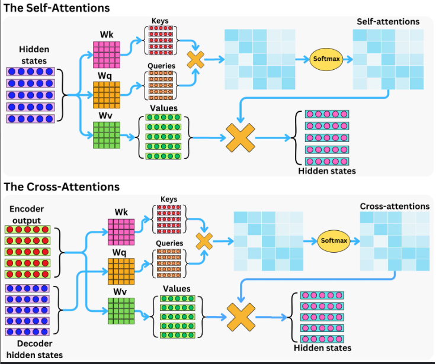
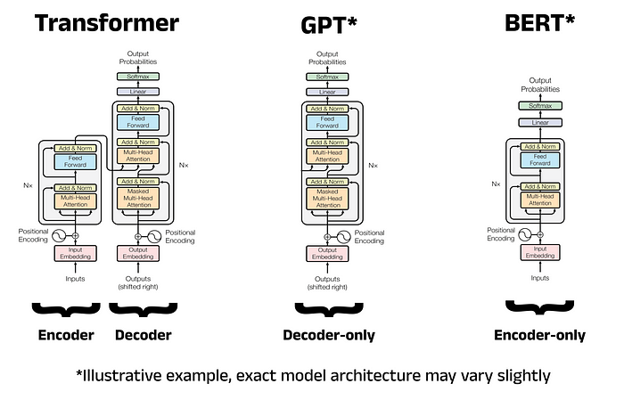

# Understanding the Transformer Architecture: The Foundation of Modern AI

---

---

## Index

- [Understanding the Transformer Architecture: The Foundation of Modern AI](#understanding-the-transformer-architecture-the-foundation-of-modern-ai)
  - [Index](#index)
  - [Pre-requisite](#pre-requisite)
  - [Introduction](#introduction)
  - [History (previous methods and their drawbacks)](#history-previous-methods-and-their-drawbacks)
  - [Transformer Architecture](#transformer-architecture)
      - [Overview](#overview)
      - [Self-Attention in detail](#self-attention-in-detail)
      - [Multi-Head Attention](#multi-head-attention)
      - [Positional Encoding](#positional-encoding)
      - [Layer Normalization](#layer-normalization)
      - [Masked self-attention/masked multi-head attention](#masked-self-attentionmasked-multi-head-attention)
      - [Cross attention](#cross-attention)
      - [Feed-Forward Networks in Transformers](#feed-forward-networks-in-transformers)
      - [Encoder-Decoder Architecture Explained](#encoder-decoder-architecture-explained)
      - [Questions](#questions)
  - [Scaling Transformers (Large Models like BERT, GPT, T5, etc.)](#scaling-transformers-large-models-like-bert-gpt-t5-etc)
      - [Key Dimensions of Scaling](#key-dimensions-of-scaling)
      - [Scaling Different Transformer Families](#scaling-different-transformer-families)
      - [Modern Scaling Practices](#modern-scaling-practices)
  - [Variants of Transformers (ALBERT, XLNet, ViT, etc.)](#variants-of-transformers-albert-xlnet-vit-etc)
  - [Applications of Transformers in NLP, Vision, and Beyond](#applications-of-transformers-in-nlp-vision-and-beyond)
  - [Conclusion](#conclusion)
  - [Image Credits and Disclaimer](#image-credits-and-disclaimer)

---

## Pre-requisite

A basic understanding of machine learning (supervised/unsupervised learning) and deep learning (ANN, CNN, RNN, LSTM and GRU) is required.
Additionally, familiarity with vector representations of text (BoW, TF-IDF, word embeddings like Word2Vec or GloVe), basic probability, and matrix multiplication will significantly help in understanding attention mechanisms mathematically and intuitively.

---

## Introduction

The Transformer architecture, introduced in "Attention is All You Need" (2017), marked a paradigm shift in how machines process sequential data.
Instead of processing sequences step by step, Transformers process entire sequences simultaneously, relying on attention to model relationships between tokens regardless of their distance.

This single design choice unlocked:

- Massive parallelization on GPUs/TPUs
- Efficient learning of long-range dependencies
- Scalability to hundreds of billions of parameters

Today, Transformers power large language models, vision systems, multimodal AI, protein structure prediction, and more.

---

## History (previous methods and their drawbacks)

Before Transformers, RNN-based architectures dominated sequence modeling:

1. Recurrent Neural Networks (RNNs)
   - Process tokens sequentially
   - Maintain a hidden state that evolves over time
   - Drawbacks
     - Poor parallelization
     - Vanishing/exploding gradients
     - Difficulty remembering long-term dependencies

2. LSTM and GRU
   - Introduced gates to control information flow
   - Improved long-range dependency handling
   - Still suffered from
     - Sequential computation bottlenecks
     - High training cost for long sequences

Transformers eliminate recurrence entirely and rely on self-attention, which directly connects all tokens in a sequence.

---

## Transformer Architecture

#### Overview

A Transformer consists of:

- Encoder stack (N identical layers)
- Decoder stack (N identical layers)

Each encoder layer contains:

- Multi-head self-attention
- Position-wise feed-forward network

Each decoder layer contains:

- Masked multi-head self-attention
- Cross-attention (encoder–decoder attention)
- Feed-forward network

Residual connections and layer normalization surround every sub-layer.

#### Self-Attention in detail

Self-attention allows each token to directly attend to every other token in the sequence.

Each token is projected into:

- Query (Q) – what am I looking for?
- Key (K) – what do I offer?
- Value (V) – what information I provide?

The attention score between tokens is computed as:

$$ \text{Attention}(Q, K, V) = \text{softmax}\left( \frac{QK^T}{\sqrt{d_k}} \right) V $$

Why scale by $\sqrt{d_k}$?

- Prevents dot products from becoming too large
- Stabilizes gradients during training

Self-attention enables:

- Long-range dependency modeling
- Context-aware representations
- Parallel computation

#### Multi-Head Attention

Instead of one attention operation, Transformers use multiple attention heads.

Each head:

- Attends to different semantic aspects
- Learns different relationships (syntax, coreference, position, etc.)

Outputs from all heads are concatenated and linearly transformed.

This improves:

- Expressiveness
- Robustness
- Representation diversity

#### Positional Encoding

Since Transformers have no recurrence or convolution, they lack inherent positional awareness.

Positional encodings inject order information by adding position-dependent vectors to token embeddings.

Sinusoidal encodings:

$$ PE(pos, 2i) = \sin\left( \frac{pos}{10000^{2i/d_{model}}} \right) $$

$$ PE(pos, 2i+1) = \cos\left( \frac{pos}{10000^{2i/d_{model}}} \right) $$

Why sinusoidal?

- Allows extrapolation to longer sequences
- Relative positions can be inferred via linear combinations

Learned positional embeddings are also commonly used in practice.

#### Layer Normalization

Layer normalization:

- Normalizes activations across feature dimensions
- Improves gradient flow
- Stabilizes deep networks

Combined with residual connections, it enables training very deep Transformer stacks.

#### Masked self-attention/masked multi-head attention

In the decoder, future tokens are masked so the model cannot "peek ahead."

This ensures:

- Causal (autoregressive) generation
- Correct training for tasks like language modeling

Masking is implemented by assigning −∞ to invalid attention scores before softmax.

#### Cross attention

Cross-attention allows the decoder to attend over encoder outputs.

Queries come from the decoder

Keys and values come from the encoder

This mechanism aligns input and output sequences, enabling:

- Machine translation
- Summarization
- Question answering

#### Feed-Forward Networks in Transformers

Each token independently passes through a two-layer MLP:

$$ FFN(x) = \max(0, xW_1 + b_1) W_2 + b_2 $$

Characteristics:

- Same weights for all positions
- Expands dimensionality (e.g., 4× hidden size)
- Adds non-linearity and expressive power

#### Encoder-Decoder Architecture Explained

- Encoder: Converts input tokens into contextual embeddings

- Decoder: Generates output tokens step-by-step

- Interaction: Decoder uses cross-attention to query encoder representations

This design cleanly separates understanding from generation.

#### Questions

1. What problem does self-attention solve compared to RNNs?

   Self-attention removes the need for sequential processing, enabling full parallelization and allowing direct modeling of long-range dependencies without suffering from vanishing gradients.

2. Why is positional encoding necessary in Transformers?

   Because Transformers lack recurrence or convolution, positional encoding injects sequence order information so the model can distinguish token positions and understand word order.

3. How does multi-head attention improve model performance?

   Multi-head attention allows the model to attend to multiple representation subspaces simultaneously, capturing diverse linguistic and semantic relationships in parallel.

4. What is the role of masking in the decoder?

   Masking prevents the decoder from accessing future tokens during training, ensuring causality and enabling correct autoregressive generation.

5. How do encoder and decoder interact in the Transformer?

   The decoder uses cross-attention to attend over encoder outputs, allowing it to condition generation on the encoded input sequence.

---

## Scaling Transformers (Large Models like BERT, GPT, T5, etc.)

Scaling Transformers involves systematically increasing model capacity, training data, and computational resources, while maintaining a balance dictated by empirical scaling laws.

#### Key Dimensions of Scaling

- **Depth**: Increasing the number of Transformer layers
- **Width**: Increasing hidden dimensions, attention heads, and feed-forward network size
- **Data**: Training on larger and more diverse datasets
- **Compute**: Leveraging distributed training, mixed precision, and specialized hardware

#### Scaling Different Transformer Families

- **BERT**: Scales encoder-only architectures using masked language modeling
- **GPT**: Scales decoder-only architectures for autoregressive generation
- **T5**: Scales encoder–decoder architectures using a unified text-to-text framework

#### Modern Scaling Practices

Modern large-scale models follow compute-optimal scaling laws, ensuring that model size and dataset size grow together to maximize performance efficiency. Advances in optimization techniques and parallel training strategies have made it possible to train models with hundreds of billions of parameters.

---

## Variants of Transformers (ALBERT, XLNet, ViT, etc.)

Over time, many Transformer variants have been proposed to address specific limitations of the original architecture, such as memory usage, training efficiency, modality constraints, or task-specific performance.

- **ALBERT (A Lite BERT)**
  Reduces memory consumption and parameter count by sharing parameters across layers and factorizing embedding matrices. This allows ALBERT to scale to deeper models while maintaining efficiency, often matching or exceeding BERT’s performance with far fewer parameters.

- **XLNet**
  Introduces a permutation-based training objective that models bidirectional context without masking tokens. By combining the strengths of autoregressive and autoencoding approaches, XLNet captures richer contextual dependencies and improves performance on several NLP benchmarks.

- **Vision Transformer (ViT)**
  Extends the Transformer architecture to computer vision by splitting images into fixed-size patches and treating them as tokens, similar to words in a sentence. ViT demonstrates that convolution is not strictly necessary for strong visual representations when sufficient data and compute are available.

- **RoBERTa**
  An optimized re-training of BERT that removes the next-sentence prediction objective, uses larger batch sizes, more data, and longer training. It shows that training strategy and data scale can be as important as architectural changes.

- **DistilBERT**
  A compressed version of BERT created via knowledge distillation, where a smaller model learns to mimic a larger one. It achieves faster inference and lower memory usage while retaining most of the original model’s accuracy.

Each of these variants preserves the core Transformer components—self-attention, feed-forward layers, and positional information—while adapting the architecture or training procedure to better suit specific constraints, domains, or deployment requirements.

---

## Applications of Transformers in NLP, Vision, and Beyond

- NLP: Translation, summarization, QA, chatbots

- Vision: Image classification, detection, generation

- Multimodal: Vision-language understanding

- Science: Protein folding, drug discovery

- Time Series: Forecasting and anomaly detection

---

## Conclusion

The Transformer architecture represents one of the most important breakthroughs in AI history.
By replacing recurrence with attention, it unlocked scalability, flexibility, and performance that continue to define modern AI systems.

As research advances, Transformers remain the backbone upon which increasingly intelligent and general systems are built.

---

## Image Credits and Disclaimer

Images in this article are hosted for educational clarity and sourced from publicly available materials related to Transformer architectures. Exact original sources may not be individually identified. All images are used for non-commercial, educational purposes.

---
