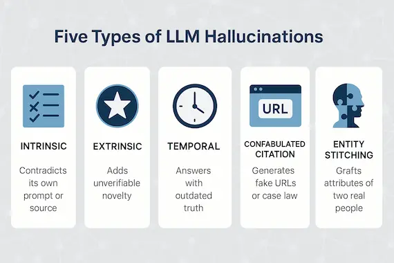
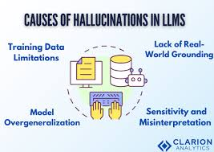

# Hallucinations in LLMs: A Deep Technical Dive into Causes, Detection, and Mitigation

Large Language Models such as GPT, LLaMA, and Claude excel at producing fluent text, yet they share a critical failure mode that blocks many deployments: hallucinations. These occur when a model generates confident, plausible-sounding answers that are factually incorrect or unsupported by the available evidence.

This write-up explores hallucinations through the lens of:

- training objectives
- probabilistic decoding
- model calibration
- retrieval and grounding
- evaluation and detection
- mitigation strategies in production systems

---

## What is a Hallucination?

An LLM hallucination is any response that:

- is not grounded in the input context,
- cannot be verified as true outside the model,
- or is factually wrong despite a confident delivery.

**Example:** “The paper *Attention Is All You Need* was published in *Nature* in 2018.” Plausible, but false.

### Intrinsic vs. Extrinsic Hallucinations

- **Intrinsic**: The output contradicts the provided context. *Context*: “The patient is 35 years old.” *Model*: “The 42-year-old patient…” The model directly conflicts with the evidence.
- **Extrinsic**: The model invents unsupported information. *Context*: “Tesla was founded in 2003.” *Model*: “Tesla was founded in 2003 by Elon Musk and Martin Eberhard in Texas.” “Texas” is unsupported and incorrect, even if other facts are true.

---

## Why Do LLMs Hallucinate?

Hallucination is not a bug — it is a natural outcome of how LLMs are trained and sampled. Here are the main drivers:

### Cause #1: Training Objective Doesn’t Reward Truth

LLMs are optimized with Maximum Likelihood Estimation:

$$
\max_\theta \sum_t \log p_\theta(x_t \mid x_{1:t-1})
$$

The reward is for predicting the next token, not for being factually accurate. A model learns *how* Wikipedia sounds or how StackOverflow answers flow, but not whether the statements are true in the real world. When uncertain, it still outputs highly probable language.

### Cause #2: LLMs Are Statistical Compressors, Not Databases

Knowledge is stored in distributed weights rather than structured tables, databases, or graphs. Even if a fact appeared during training, retrieval depends on associative memory and prompt context rather than precise indexing. The model may know how to talk about Tesla, but it might misremember the founding location, especially for:

- long-tail facts
- rare entities
- niche domains
- events that occurred after training

### Cause #3: Decoding Creates “Confident Lies”

Decoding choices can amplify internal uncertainty.

- **Greedy decoders** pick the most probable token and tend to create deterministic yet confident outputs.
- **Sampling with temperature** uses:

$$
p'_i = \frac{\exp(\log p_i / T)}{\sum_j \exp(\log p_j / T)}
$$

Higher temperature increases creativity but also hallucination risk.
- **Top-k/Top-p (nucleus)** sampling truncates candidates, deleting “safe” tokens such as “I’m not sure,” “I don’t know,” or “I cannot verify,” so fluent language can come at the cost of factuality.

### Cause #4: Exposure Bias and Error Compounding

Training on ground-truth tokens (teacher forcing) but running inference with the model’s own outputs causes small errors to compound. A single mistake (“Harvard 2019 study”) forces the model to invent authors, citations, and results to justify itself, leading to a “snowball hallucination.”

### Cause #5: Helpfulness vs. Truthfulness

Instruction-tuned and RLHF models are rewarded for being helpful, responsive, and confident. Because users dislike “I don’t know,” models learn to “always give an answer,” even under uncertainty. Human preference rewards drive this behavior more than factual correctness.

### Cause #6: Context Window and Attention Failures

Even with long context windows, attention can lose important details (“lost in the middle”), retrieval weakens, and irrelevant sections dominate. As a result, hallucinations still occur even when the required answer exists in the prompt.

---

## Hallucination vs. Confabulation vs. Fabrication

- **Hallucination**: Any incorrect or unsupported output.
- **Fabrication**: Explicitly inventing fake citations, numbers, or entities.
- **Confabulation**: Filling narrative gaps with invented details.

In practice, hallucination often blends all three phenomena.

---

## Measuring Hallucinations

Evaluation is difficult because truth depends on external knowledge.

### Human Evaluation

- Most reliable, but expensive, slow, and subjective.

### Automatic Metrics

1. **FactScore / QA-based evaluation**: Extract claims from the response and verify them via QA or evidence retrieval.
2. **Natural Language Inference (NLI)**: Judge whether the response is entailed by the context (entailment ✅, contradiction ❌, neutral ⚠️).
3. **Entity-level overlap**: Compare entity mentions; fails when relations are wrong or paraphrases appear.
4. **LLM-as-a-judge**: Use a stronger model to critique another. Works but can hallucinate, inject bias, and requires careful prompting.

---

## Detecting Hallucinations (Engineering View)

1. **Self-Consistency Sampling**: Generate multiple answers with different seeds; wildly varying responses signal uncertainty.
2. **Calibration via Confidence Scores**: Low average log probability suggests uncertainty, but confidence is not the same as correctness.
3. **Retrieval Verification**: Generate a response, extract claims, retrieve supporting documents, and verify each claim. This works well for enterprise-grade systems.
4. **Citation Grounding**: Force answers to quote the context, dramatically reducing hallucinations in RAG agents and document QA systems.

---

## Mitigation Strategies

### Retrieval-Augmented Generation (RAG)

Shift from solely parametric memory to retrieve-and-generate workflows. Retrieve relevant documents, inject them into the prompt, and ground answers in source text. RAG still hallucinates when retrieval fails, the context is noisy, the model ignores evidence, or prompts are too open-ended.

**Best practices:** chunking with overlap, hybrid dense + sparse search, reranking via cross-encoders, and a strict “answer only from context” policy.

### Constrained Decoding

Force the model to follow strict output structures: JSON schemas, tool outputs, extractive answers, or mandatory citations.

**Examples:**

“- Return answers ONLY as bullet points from the provided text.”
“- If not found, output: NOT FOUND.”

### Post-generation Verification (“Generate then Check”)

Two-pass systems where a verifier inspects the draft, highlights unsupported statements, requests regeneration, or adds “cannot verify” disclaimers. This pattern works well in production.

### Fine-tuning for Faithfulness

Fine-tune on truthful QA datasets, grounded summarization corpora, and refusal-behavior data. This is most effective when you control domain data, reward signals, and evaluation loops.

### Tool Use: Make the Model Call APIs Instead of Guessing

Rather than asking “What’s the latest Tesla stock price?”, let the system call a finance API, database query, or web search. The LLM becomes a controller rather than a standalone source of truth.

### Prompting Techniques

Good prompts reduce hallucination:

“- If unsure, say you don’t know.”
“- Only answer using the provided context.”
“- Cite exact lines supporting your answer.”
“- List assumptions explicitly.”

⚠️ Prompts help but cannot guarantee correctness.

---

## The Hard Truth

Hallucinations persist because generation is probabilistic, knowledge is incomplete, training lacks truth constraints, and language modeling prioritizes fluency. Production systems should instead prioritize:

- reducing hallucination rates,
- detecting hallucinations early,
- failing safely (refusing when evidence is missing).

---

## A Low-Hallucination Pipeline

Real-world systems often follow this architecture:

1. **Input classification**: Determine if the request is factual, creative, or advisory.
2. **Retrieval**: Fetch relevant sources when the request is fact-based.
3. **Grounded generation**: Use strict prompts and cite context.
4. **Verification**: Extract claims and check evidence.
5. **Output safety**: Add disclaimers when evidence is weak or refuse the answer.

---

## Summary

- Hallucinations arise because LLMs optimize for next-token probability rather than truth.
- Decoding choices and alignment goals can amplify confident but wrong answers.
- Grounding through RAG and verification remains the most effective mitigation.
- In production, build systems that detect hallucinations, fail safely, and avoid assuming correctness.

---

## Image Credits and Disclaimer

Images in this article are hosted for educational clarity and sourced from publicly available materials related to Transformer architectures. Exact original sources may not be individually identified. All images are used for non-commercial, educational purposes.

---