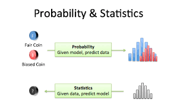
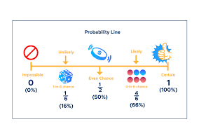
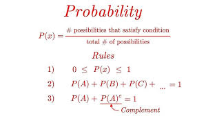
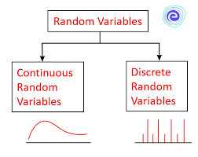
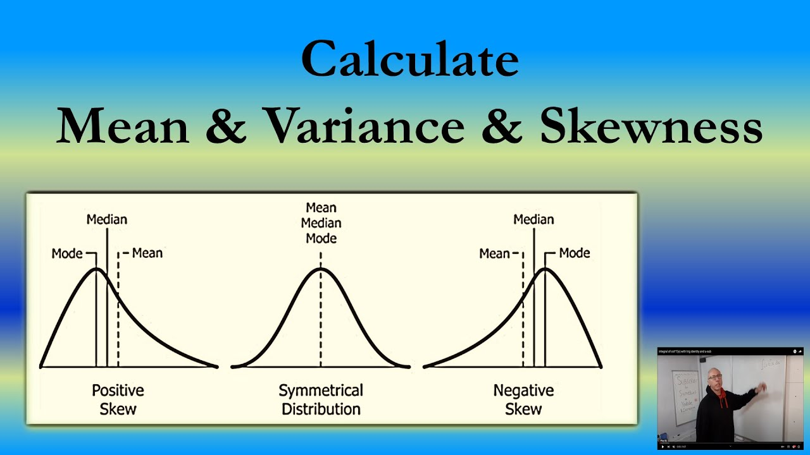
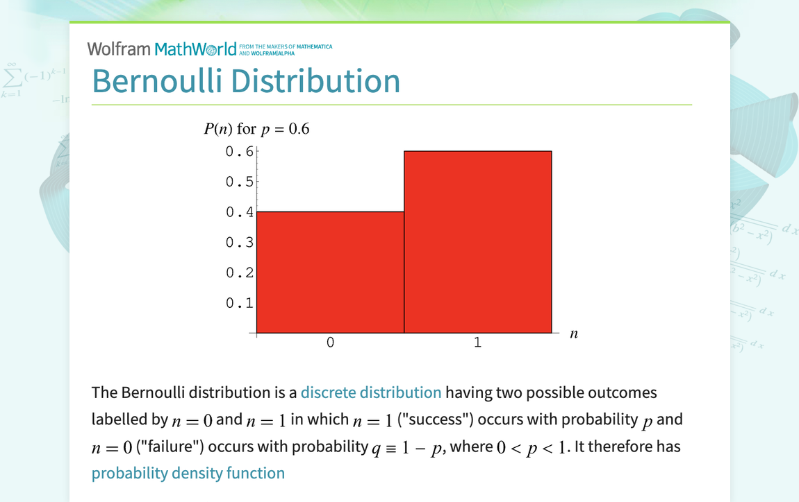
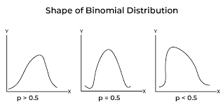
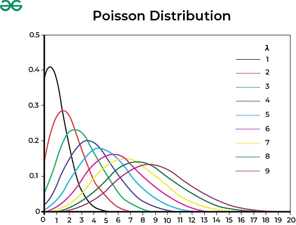
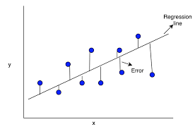

### Probability & Statistics
Random Variables, Distributions, Mean/Variance, Regression



---

## 1. Real Business Story: Swiggy/Zomato-Style App



Imagine you are a **Data Scientist** at a food delivery company.

Every day you deal with **uncertainty**:

- Customers place orders at **random times**.
- Food preparation time changes with **restaurant load**.
- Riders get stuck in **traffic** or **rain**.
- **Rush hours** create sudden spikes in demand.

The company wants clear answers to questions like:

| Business Question | What Probability / Statistics / ML Do |
| ------------------ | -------------------------------------- |
| “What is the average delivery time in each area?” | Estimate **mean** |
| “Which areas are unstable or too unpredictable?” | Measure **variance** |
| “How likely is an order to be late?” | Use **probability models** |
| “Predict delivery time for a new order” | Build a **regression model** |
| “Assign riders efficiently” | Use **ML + optimization** |




So **probability & statistics** are the **language of randomness**, and **ML** learns patterns from that randomness to make better decisions.

---

## 2. Core Concept 1: Random Variables

A **random variable** is just a **number whose value is uncertain** because the world is random.

### 2.1 Example in a Delivery App

Let

$$X = \text{delivery time in minutes for one order}$$

For different orders on different days, \(X\) could be:

- 18 minutes
- 27 minutes
- 55 minutes

You **don’t know** the value before the order happens → so \(X\) is **random**.

### 2.2 Two Types of Random Variables



#### (A) Discrete Random Variable

- Takes **countable values** like 0, 1, 2, 3, ...
- Example:

	$$X = \text{number of orders in 1 hour}$$

	Possible values: 0, 1, 2, 3, ...

- Real DS use-case: **Staffing riders** based on expected demand per hour.

#### (B) Continuous Random Variable

- Takes values on a **continuous scale** like time, money, temperature.
- Example:

	$$X = \text{delivery time in minutes}$$

	Possible values: 22.4, 22.41, 22.412, ...

- Real DS use-case: **Predicting delivery time** using regression.

We don’t know the exact value of \(X\), but we can talk about **probabilities**, like \(P(X > 40)\):

- “What is the chance this order takes more than 40 minutes?”


---

## 3. Core Concept 2: Mean and Variance

These describe the **typical value** and **stability** of a random variable.



### 3.1 Mean – The “Typical” Value

The **mean** answers:

> “If I look at thousands of deliveries, what delivery time should I expect on average?”

- Notation: \(\mathbb{E}[X]\) or \(\mu\).

Example:

- Mean delivery time in Area A = 28 minutes.
- So customers can usually expect **around 28 minutes**.

For a **sample of data** with values \(x_1, x_2, \dots, x_n\):

$$\bar{x} = \frac{1}{n} \sum_{i=1}^n x_i$$

### 3.2 Variance – How Risky or Unstable It Is

The **variance** answers:

> “Do delivery times stay close to the average, or jump around a lot?”

- Notation: \(\mathrm{Var}(X)\) or \(\sigma^2\).

Example:

- Area A mean = 28 min.
- If variance is **high** → sometimes 18 min, sometimes 60 min.
	- Feels **unreliable**.
- If variance is **low** → most deliveries around 27–30 min.
	- Feels **stable** and predictable.

Sample variance from data:

$$s^2 = \frac{1}{n - 1} \sum_{i=1}^n (x_i - \bar{x})^2$$

Why \(n-1\)?

- In real life we only see a **sample**, not the entire population.
- Using \(n-1\) corrects the estimate so it is **unbiased**.

### 3.3 Why Variance Matters in Business & ML

- High-variance regions may need:
	- More riders.
	- Better routing.
	- Extra buffer time shown to customers.

Mean tells **“what to expect on average”**.  
Variance tells **“how risky or unstable it is”**.

---

## 4. Distributions – How Randomness “Behaves”

A **distribution** tells you:

> “Which values are common, and which values are rare?”

You can think of it as the **shape of randomness**.

### 4.1 Bernoulli Distribution (Yes/No Events)



Use when the result is just **Yes/No** or **0/1**.

- Example: Was the order late?
	- Late = 1
	- Not late = 0

Parameter:

$$p = P(X = 1) = \text{probability the order is late}$$

- Mean: \(\mathbb{E}[X] = p\).
- Variance: \(\mathrm{Var}(X) = p(1 - p)\).

ML-style use-cases:

- “Will this customer churn?” (Yes/No)
- “Will this payment fail?”
- “Is this transaction fraud?”

This is the foundation of **binary classification** problems.

### 4.2 Binomial Distribution (Count of Yes/No Events)



Use when you **repeat a Bernoulli trial n times** and count successes.

- Example: Out of 50 deliveries today, how many are late?

Parameters:

- \(n = 50\): number of deliveries.
- \(p = P(\text{late})\): probability a single order is late.

Random variable:

$$X = \text{number of late deliveries out of 50}$$

Use-cases:

- Estimate how many **late orders** to expect in an hour/day.
- Monitor **SLA failures** (e.g., “more than 10 late orders today”).

### 4.3 Poisson Distribution (Events Per Time)



Use when you model **number of events in a fixed time window**.

- Example: Number of orders arriving in 1 minute.
- Example: Number of customer support tickets per hour.

Why it fits:

- Events arrive **randomly**.
- Average rate is roughly **stable** over time.

Delivery use-case:

- “At 8 pm, how many orders per minute will come in this area?”
	- Helps with **rider allocation** and staffing.

### 4.4 Exponential Distribution (Time Between Events)


Use when you model **time between arrivals**.

- Example: Time between two consecutive orders.
- Example: Time until next customer complaint.

Ops/ML use-cases:

- System load modeling.
- Server traffic simulation.

### 4.5 Normal (Gaussian) Distribution (Bell Curve)


The famous **bell-shaped curve**. It appears in many real-world measurements:

- Delivery time in a **stable** area.
- Human height.
- Sensor noise.

Parameters:

- Mean \(\mu\).
- Standard deviation \(\sigma\).

Rule of thumb:

- About **68%** of values lie in \(\mu \pm 1\sigma\).
- About **95%** of values lie in \(\mu \pm 2\sigma\).

Data science use-cases:

- **Anomaly detection** (very large deviations from the mean).
- **Confidence intervals**.
- **A/B testing** metrics.

---

## 5. Regression – Predicting a Number



**Regression** means predicting a **continuous value** like time, price, or demand.

### 5.1 Delivery Prediction Problem

Features (inputs \(X\)) could be:

- `distance_km`
- `restaurant_busy` (low / medium / high)
- `rain` (0 or 1)
- `time_of_day` (morning / evening / night)
- `traffic_index`

Target (output \(y\)):

- `delivery_time_min`

Goal: Learn a function that maps **inputs → predicted time**.

### 5.2 Simple Linear Regression (One Feature)

Simplest case, with only distance as input:

$$y = a + b x$$

Where:

- \(a\): intercept → baseline time (pickup + packing etc.).
- \(b\): slope → extra **minutes per km**.

In real life, same distance can still give different times due to traffic, weather, rider speed.  
So a more realistic model is:

$$y = a + b x + \text{noise}$$

ML goal: learn \(a\) and \(b\) so that predicted times are **as close as possible** to real times.

### 5.3 Why Regression Helps the Business

Good delivery-time predictions mean:

- More accurate ETAs → **higher customer trust**.
- Fewer cancellations.
- Better rider assignment and routing.
- Cost savings and better **operations planning**.

---

## 6. A More Realistic Python Example (with ML Flavor)

Below is a beginner-friendly Python example using `pandas` and `scikit-learn`.

We use **two features**:

- `distance_km`
- `rain` (0 = no rain, 1 = raining)

and try to predict `time_min`.

```python
import pandas as pd
from sklearn.model_selection import train_test_split
from sklearn.linear_model import LinearRegression
from sklearn.metrics import mean_absolute_error

# Sample realistic dataset
data = {
		"distance_km": [1, 2, 3, 4, 5, 6, 7, 8],
		"rain":        [0, 0, 0, 1, 1, 0, 1, 0],  # 1 = raining
		"time_min":    [15, 18, 21, 30, 35, 29, 40, 34]
}

df = pd.DataFrame(data)

# Features (X) and target (y)
X = df[["distance_km", "rain"]]
y = df["time_min"]

# Split data into train and test (like real ML workflow)
X_train, X_test, y_train, y_test = train_test_split(
		X, y, test_size=0.25, random_state=42
)

# Train model
model = LinearRegression()
model.fit(X_train, y_train)

# Predict on test set
y_pred = model.predict(X_test)

# Evaluate with Mean Absolute Error (MAE)
mae = mean_absolute_error(y_test, y_pred)

print("Intercept:", model.intercept_)
print("Coefficients:", model.coef_)
print("Test MAE (avg error in minutes):", mae)
```

What a beginner should take away:

- We used **multiple features**, not just distance.
- We split into **train** and **test**:
	- Train → learn the model.
	- Test → check how well it works on **unseen data**.
- **MAE** (Mean Absolute Error) tells:

> “On average, how many minutes are we wrong by?”

This is exactly how ML is used in companies: build a model, evaluate it, and then improve.

---

## 7. Probability of Extreme Delays (Tail Events)

Suppose delivery time in a stable area is roughly **Normal** with:

- Mean \(\mu = 30\) minutes.
- Standard deviation \(\sigma = 8\) minutes.

We might ask:

> What is the probability that a delivery takes **more than 50 minutes**?

This is \(P(X > 50)\) for a Normal distribution.

You don’t need exact formulas in a beginner session, just the **idea**:

- If \(50\) is **far above** the mean (many \(\sigma\) away), probability is **small**.
- These **rare extreme delays** are called **tail events**.

Why this matters in business:

- Estimate **SLA breach probability**.
- Estimate **refund / compensation cost**.
- Monitor **risk** and trigger alerts.
- Decide **surge pricing** during high-risk periods.

---

## 8. Practice Questions (ML-Flavored)

1. **Identify the random variable type**

	 For each, say **discrete** or **continuous**, and **why**:

	 - (a) Number of app orders in 10 minutes.
	 - (b) Time spent watching reels in seconds.
	 - (c) Whether a payment fails (Yes/No).

2. **Compute mean and variance**

	 Delivery times (minutes) for 5 orders:

	 \[20, 25, 30, 25, 40\]

	 - Compute the sample mean \(\bar{x}\).
	 - Compute the sample variance \(s^2\) using \(n - 1\) in the denominator.
	 - If variance is large, what does that mean for **user experience**?

3. **Regression interpretation**

	 Suppose a fitted model for delivery time is:

	 $$\hat{y} = 12 + 4x$$

	 where \(x\) is distance in km and \(\hat{y}\) is predicted time in minutes.

	 - What does the **intercept 12** mean?
	 - What does the **slope 4** mean?
	 - What is the predicted time for a **3 km** delivery?

4. **Feature-thinking**

	 You want to improve ETA prediction. Which features might help the model?

	 - (a) Distance.
	 - (b) Rain (0/1).
	 - (c) Restaurant rating.
	 - (d) Traffic level.
	 - (e) Rider experience.

	 Think which of these could be useful and why. (Hint: in practice, **all** can help, but some matter more depending on data.)

---

## 9. Quick Summary

- **Random variables** represent uncertain outcomes (delivery time, late/not late, number of orders).
- **Mean** tells the typical or expected value; **variance** tells how stable or risky it is.
- **Distributions** model different patterns:
	- Bernoulli → yes/no.
	- Binomial → count of yes/no.
	- Poisson → events per time window.
	- Exponential → time between events.
	- Normal → bell-curve behavior around a mean.
- **Regression** predicts numbers (ETA, revenue, demand) from features.
- **ML workflow**: use multiple features, split train/test, evaluate with metrics like MAE.

Use **probability, statistics, and ML** to make smarter, data-driven decisions.
