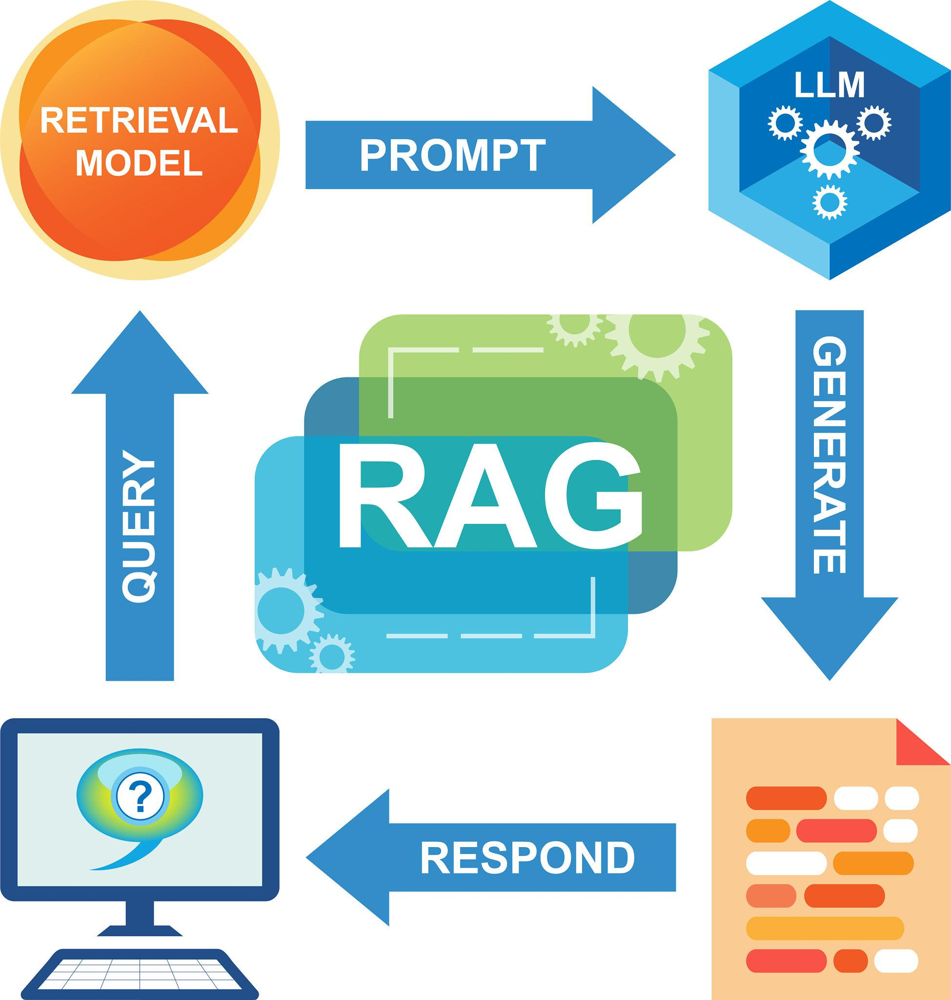
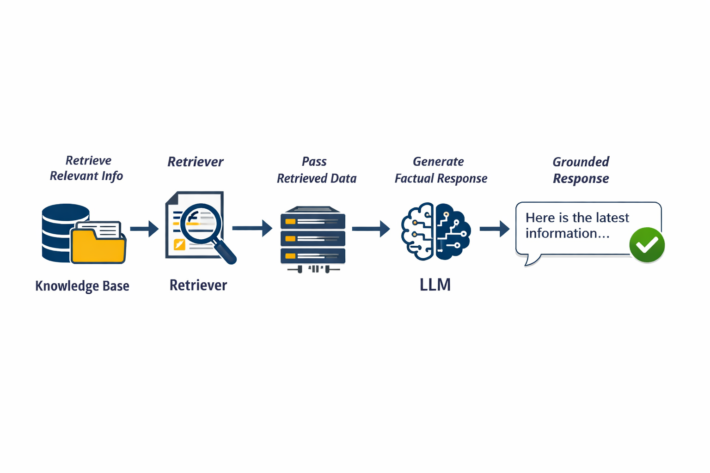
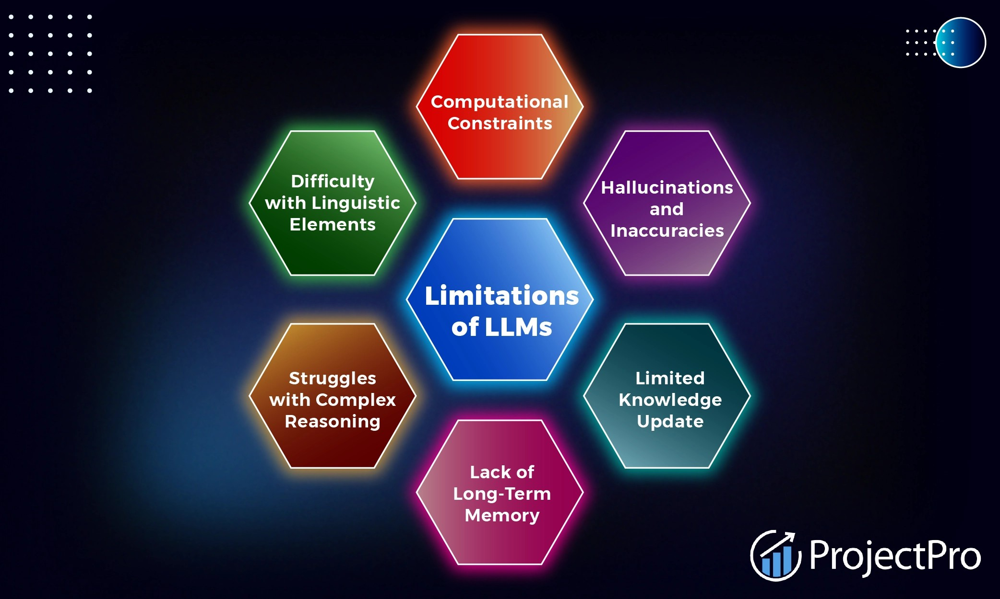
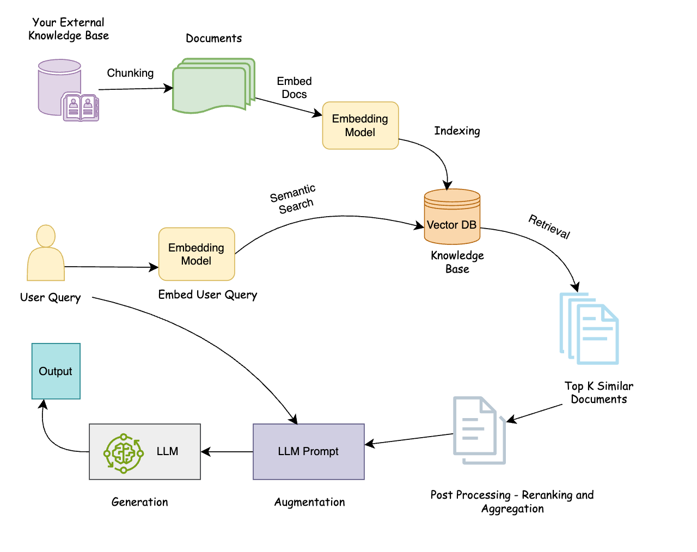
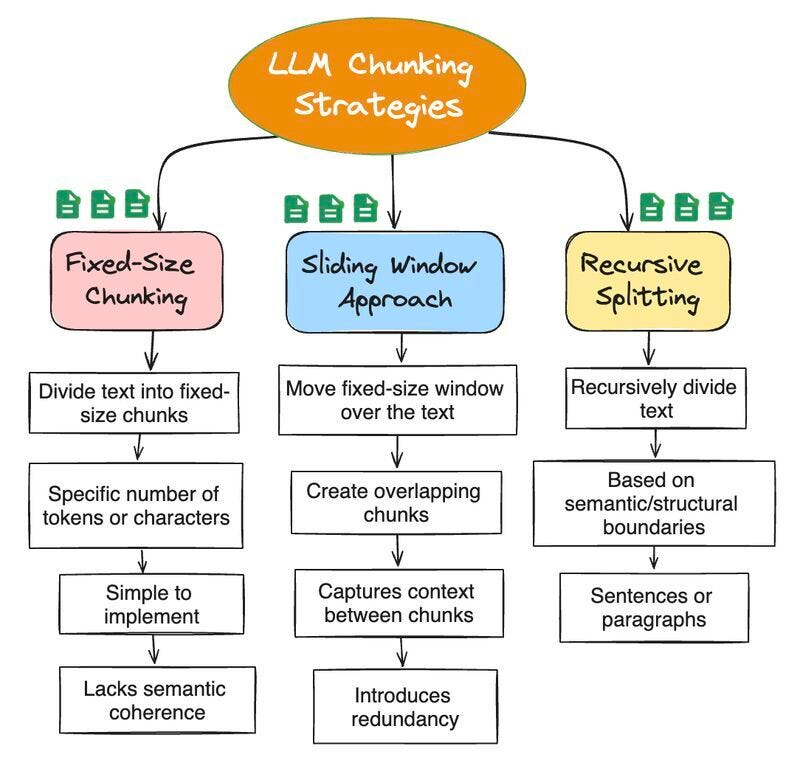
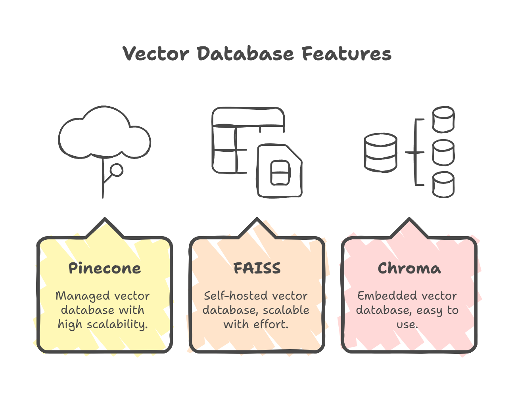
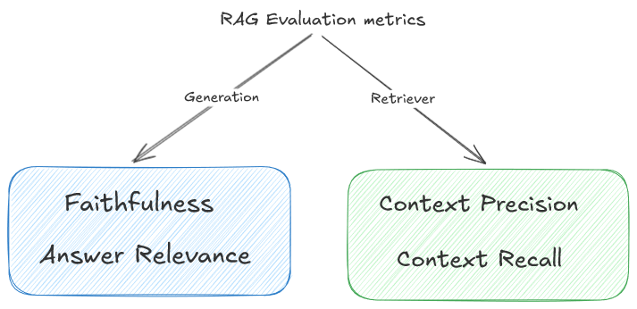
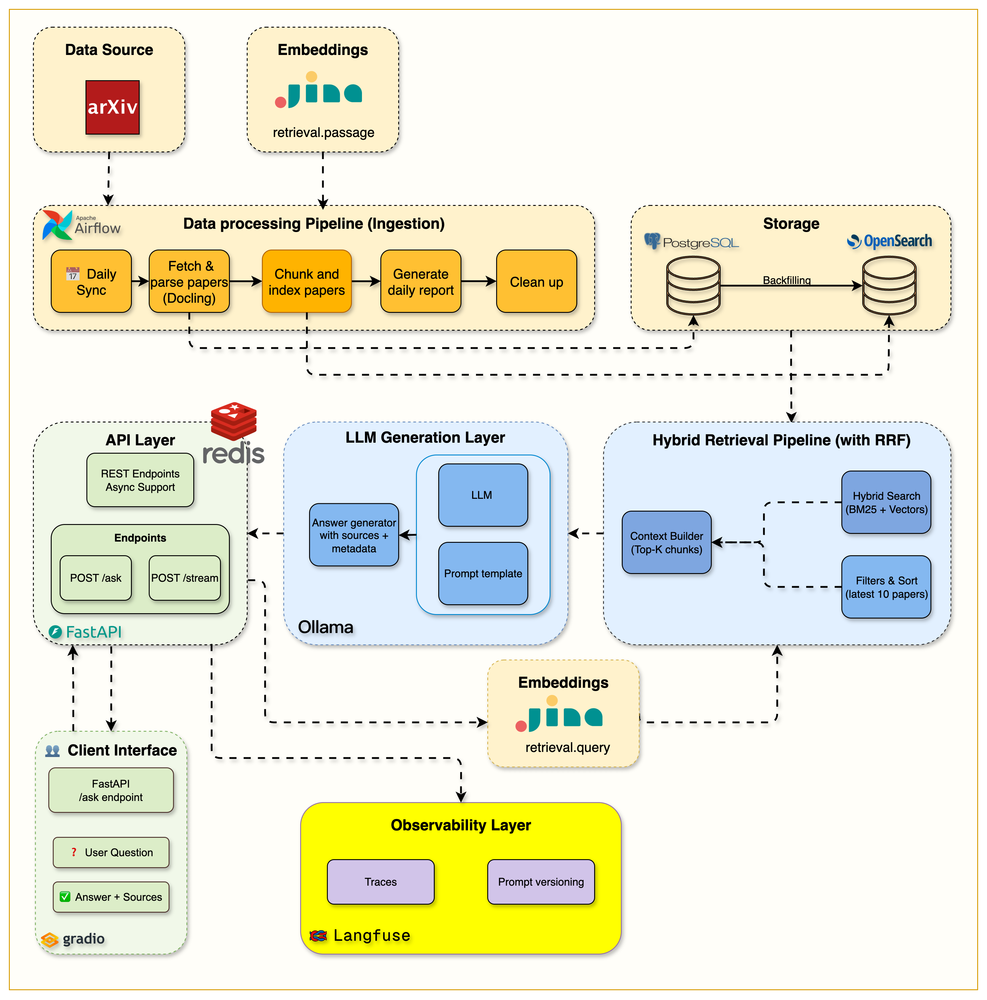

# RAG Explained: Teaching LLMs to Fact-Check Themselves

Let’s be honest — Large Language Models (LLMs) are incredibly smart… until they aren’t.

They can explain quantum physics or write code, but sometimes they confidently make things up. Not because they want to lie, but because they’re trained to predict language, not verify facts. If you’ve read my previous post on hallucinations, you know how easily an AI can sound correct while being completely wrong.

And that’s exactly where Retrieval-Augmented Generation (RAG) enters the story.

Instead of forcing an LLM to rely only on memorized training data, RAG gives it a new superpower: the ability to look things up. Think of it like turning a student who guesses answers into one who actually opens the textbook.

Imagine asking:

> “What changed in the latest API version released yesterday?”

A vanilla LLM might struggle — its training data is static. But a RAG-powered system fetches the latest documentation, feeds it to the model, and generates an answer grounded in real information. Same intelligence, now with receipts.

In this deep dive, we’ll break down how RAG works under the hood — from document processing to vector databases and retrieval strategies. By the end, you’ll understand why RAG is becoming the default for reliable AI.

If hallucinations are the problem, RAG is the solution that helps LLMs pause, search, and fact-check.

---

## 1. What is Retrieval-Augmented Generation?

LLMs don’t “know” things — they predict things.

Answers are based on learned patterns, which leads to:
- 🧠 **Hallucinations:** Confident guesses filling gaps.
- ⏰ **Outdated Knowledge:** Anything released after training is invisible.

RAG changes the game.

At a high level, RAG allows an LLM to retrieve real information from external sources before answering. The model becomes a researcher: it searches, reads, then responds.

### A Simple Definition

Retrieval-Augmented Generation (RAG) is an architecture where:
- Relevant documents are retrieved from a knowledge source.
- Those documents are injected into the prompt.
- The LLM generates a response grounded in that context.

The model doesn't become smarter — it becomes better informed at runtime.

#### Why This Matters

Imagine asking:
> “What features were added in version 4.3 of our internal product?”

A traditional LLM guesses. A RAG system pulls release notes and answers with facts. It’s a built-in fact-checking layer.

**High-level architecture:**
Knowledge Base → Retriever → LLM → Grounded Response

Next, we’ll see how documents turn into vectors, context, and finally, reliable answers.

---

## 2. Why Do LLMs Need RAG?

Traditional LLMs rely on *parametric knowledge* — everything lives inside fixed weights. This has real limitations.

### 🧠 1. Parametric Knowledge Has Limits
LLMs don’t store facts like a database. They compress patterns into parameters. This works for general knowledge but fails for:
- Corporate docs
- New research
- Rapid product updates
- Private datasets

When you ask something specific, the model fills gaps with probability, leading to hallucinations. RAG shifts from “What do I remember?” to “What can I look up?”

### ⏰ 2. Static Training Data Ages Fast
Training a model today means it’s outdated tomorrow. In fast-moving domains, keeping knowledge fresh without retrieval requires expensive retraining or fine-tuning.

With RAG, freshness comes from your source documents. **Update the docs → the system instantly gets smarter.** No retraining needed.

### 💸 3. Retraining Is Expensive
Fine-tuning is great for style, not facts. Regular retraining is slow, costly, and risks overfitting. RAG is more economical: fetch facts dynamically like a search engine instead of printing new encyclopedias.

### 🔍 4. Precision Beats Guesswork
Without retrieval, answers lack grounding. With RAG, responses are tied to specific documents, allowing you to cite sources and debug mistakes. It turns “creative guessers” into evidence-backed assistants.

### ⚖️ Retrieval vs Memory
Think of an LLM as a chef:
- **Parametric knowledge** = Memorized recipes.
- **Retrieval** = Opening a cookbook.

Memorization is powerful, but when the menu changes weekly, the cookbook wins. RAG makes AI systems up-to-date, grounded, and cost-efficient.

---

## 3. The RAG Pipeline: A High-Level Overview

Every RAG system follows a three-stage relay:

**Indexing → Retrieval → Generation**

Let’s break it down.

#### 📚 Stage 1 — Indexing (Preparing Knowledge)
Before retrieval, documents need preparation:
1. Clean and process raw files (PDFs, docs).
2. Split text into chunks.
3. Convert chunks into **embeddings** (vectors).
4. Store them in a vector database.

You aren't answering yet — just organizing the library.

#### 🔎 Stage 2 — Retrieval (Finding Context)
When a user asks a question:
1. The query becomes an embedding.
2. The retriever searches the vector database.
3. It pulls the most relevant chunks based on similarity.

The system jumps directly to semantically related sections — smart lookup instead of memory recall.

#### ✨ Stage 3 — Generation (Answering)
The LLM receives the retrieved chunks alongside the user’s question and generates a grounded response. It doesn’t get smarter; it just gets evidence.

**Simplified flow:**
Raw Docs → Indexing → Vector DB → Retriever finds top-k → Prompt + Context → Grounded Answer

---

### 3.1. Document Processing and Chunking

Documents must be split into **chunks**. LLMs have fixed context windows and focus better on specific inputs.

**Common Chunking Strategies:**
- **Fixed-size:** Split every N tokens.
- **Sentence-based:** Break at natural boundaries.
- **Semantic:** Group related ideas.

**Size & Overlap:**
- **Chunk size:** Small = precise search; Large = richer answers.
- **Overlap:** Repeats clear context to avoid cutting ideas in half.

**Metadata:** Attach source, title, and timestamp to chunks for better filtering and debugging.

---

### 3.2. Embeddings: Converting Text to Vectors

Computers understand math, not meaning. We convert text into numbers called **embeddings**.

**What Are They?**
Embeddings are numerical representations where:
- Similar meanings are close in vector space.
- Different meanings are far apart.

“**How to reset password**” and “**Change login credentials**” look different but have similar embeddings.

**Popular Models:** OpenAI, Sentence-BERT. Choice depends on language, speed, and cost.

**Mental Model:** Imagine chunks floating in a 3D galaxy of meaning. The query lands in space, and the retriever finds its nearest neighbors.

---

### 3.3. Vector Databases and Indexing

Traditional SQL databases search for exact matches. RAG needs similarity search, so we use **Vector Databases**.

**Why Vector DBs?**
They are optimized for high-dimensional semantic search (“Find the most similar concept”).

**Popular Stores:** Pinecone, Weaviate, FAISS, ChromaDB.

**Indexing:**
- **Flat:** Exact but slow.
- **HNSW:** Fast, graph-based (popular).
- **IVF:** Scalable clustering.

---

### 3.4. Retrieval Mechanisms

**Semantic vs. Keyword Search:**
- **Traditional:** Matches words.
- **Semantic:** Matches meaning. A query like “billing update” finds “payment modification.”

**Similarity Metrics:**
- **Cosine Similarity:** Focuses on direction (most common).
- **Dot Product / Euclidean:** Alternatives based on magnitude or distance.

**Top-k Retrieval:**
Systems usually grab the **top-k** (e.g., top-5) matches to provide multiple perspectives without overwhelming the model.

---

### 3.5. Context Injection and Prompt Engineering

**Context Injection:**
We feed retrieved knowledge to the model.
*User Question → Retrieved Context + User Question → LLM*

**Prompt Template:**
> You are an assistant answering with the context below.
> Context: [chunks]
> Question: [query]

**Context Window:**
LLMs can’t read infinite text. Chunking and ranking decide what fits in the window.

**Prompting:**
Good design reduces hallucinations and encourages citations. It’s the final alignment layer.

---

## 4. RAG Variants and Architectures

There isn't just one way to build RAG. Architectures evolve for better control.

### 🧱 Naive RAG (Classic)
*Query → Retrieve → Answer*
- **Pros:** simple, fast.
- **Cons:** retriever noise, blind trust in context.
Like handing someone a stack of papers and hoping they read the right ones.

### 🔄 Self-RAG (Reflective)
The model evaluates its own output. It might generate a draft, check if it needs more info, and refine.
“**Do I have enough evidence?**”
- **Pros:** accuracy, reasoning depth. Great for research.

### 🛠️ Corrective RAG (Verified)
Adds a safety net.
*Retrieve → Answer → Verify (Reranker/Model) → Fix*
- **Pros:** reduces hallucinations, builds trust.

### 🤖 Agentic RAG (autonomous)
The model acts as a researcher:
*Plan → Retrieve → Think → Retrieve Again → Answer*
- **Pros:** handles complex, multi-step tasks.
- **Cons:** higher latency and cost.

**Quick Guide:**
- **Naive:** Prototypes.
- **Self/Corrective:** High accuracy/trust needs.
- **Agentic:** Complex workflows.

---

## 5. Hybrid Search Strategies

Pure semantic search isn't always enough. **Hybrid search** combines the best of both worlds.

### 🔀 Dense vs. Sparse
- **Dense (Vector):** Captures intent/meaning.
- **Sparse (Keyword):** Captures exact terms (IDs, names).

Example: “Error E-482”. Semantic might miss the code; keyword catches it. Hybrid blends them.

### 🏆 Reranking
A pipeline upgrade:
1. Retrieve top-50 chunks quickly.
2. Use a precise **Reranker** model to reorder them.
3. Send only the best top-5 to the LLM.

Result: Higher quality context, efficient token usage.

### 🧱 Multi-Stage Pipeline
*Keyword/Vector Search → Reranker → LLM*
Use hybrid search when documents have jargon/IDs or queries vary in precision.

---

## 6. Evaluation Metrics

How do we represent success? Measure both parts.

### 🔎 Retrieval Metrics
- **Precision:** How much retrieved info is relevant? (Less noise).
- **Recall:** Did we get all the meaningful facts? (Less missing info).
- **MRR:** Was the best answer at the top?

### ✨ Generation Metrics
- **Faithfulness:** Is the answer grounded in context?
- **Relevance:** Does it answer the user?
- **Completeness:** Did it miss details?

**Mindset:** Evaluate retrieval (did I find it?) and generation (did I say it right?) separately. Use gold-standard datasets and automated scoring.

---

## 7. Challenges and Limitations

RAG isn't magic.

### 🪟 Limits
- **Context Window:** Too many chunks truncate important info.
- **Imperfect Retrieval:** Irrelevant or duplicate chunks confuse the LLM.
- **Costs:** Vectors, reranking, and longer prompts increase overhead.

### ⚠️ Failure Modes
- Citing the wrong chunk.
- Relying on outdated docs.
- Bias toward longer documents.

Design around these: use reranking, clean data, and tight prompts.

---

## 8. Building a RAG System: Step-by-Step

**1. Prepare Data:** Clean PDFs/docs, chunks, and metadata.
**2. Create Embeddings:** Convert text to vectors.
**3. Set Up Retrieval:** Configure Top-k and similarity metrics. EXPERIMENT here.
**4. Build Prompts:** Inject context clearly.
**5. Iterate:** Test real queries, tune chunk sizes, and measure metrics.

Develop like tuning an instrument, not just writing code.

---

## 9. RAG in Production

Moving from demo to scale introduces engineering challenges.

**Scaling:** Distributed vector DBs and async pipelines keep answers fast.
**Caching:** Cache frequent queries and embeddings to cut latency/costs.
**Observability:** Trace retrieval quality, tokens, and latency. Log what chunks were used — it’s your main debugging tool.

**Debugging:**
- Did we fetch the right chunks?
- Did the prompt work?
- Did the LLM fail?
Trace the logs.

---

## 10. Fine-Tuning vs. RAG

They solve different problems — and understanding that difference is key to choosing the right architecture.

At a high level:

**Fine-Tuning** changes how the model behaves.  
**RAG** changes what information the model sees at runtime.

---

### ⚖️ The Core Difference

**Fine-Tuning**
- Adjusts the model’s internal weights
- Teaches consistent tone, structure, or reasoning patterns
- Knowledge becomes embedded inside the model
- Updates require retraining or additional tuning

**RAG**
- Injects external knowledge during inference
- Keeps information dynamic and easy to update
- Allows citations and traceable sources
- No retraining required when data changes

A simple mental shortcut:

> Fine-tuning shapes behavior.  
> RAG supplies evidence.

---

### 🧭 When to Use Fine-Tuning

Fine-tuning works best when your goal is consistency rather than freshness.

Use Fine-Tuning for:

- Style consistency across responses
- Structured output formats (JSON, templates, reports)
- Domain-specific reasoning patterns
- Reliable tone or brand voice
- Tasks where rules rarely change

Example mindset:  
You’re teaching the model *how to speak*, not *what new facts to learn every day*.

---

### 🔎 When to Use RAG

RAG shines when knowledge must stay current or verifiable.

Use RAG for:

- Frequently updated documentation
- Internal company knowledge bases
- Research-heavy workflows
- Technical support assistants
- Systems requiring citations or grounding

Instead of retraining the model every time your data changes, you simply update the knowledge source.

---

### 🤝 When to Use Both Together

Many production systems combine both approaches:

- Fine-tune for structure, tone, or reasoning patterns
- Use RAG to inject fresh, domain-specific knowledge

This hybrid setup gives you:

- Reliable response style
- Grounded, up-to-date answers
- Lower maintenance compared to heavy retraining cycles

Think of it like this:

Fine-tuning builds the personality.  
RAG provides the facts.

---

## 11. The Future of RAG

RAG is becoming more autonomous.
- **Multimodal:** Retrieve images options, tables, and video suitable for the prompt.
- **Graph-based:** Connect entities for better reasoning across documents.
- **Agentic:** Self-improving pipelines that rewrite queries and verify answers.

Models won't need to memorize everything; they just need to know how to search.

---

## 12. Key Takeaways

**When to use RAG:**
- You need up-to-date, grounded answers.
- You have private/internal data.
- Transparency (citations) is required.

**Avoid Pitfalls:**
- Don't dilute prompts with too much context.
- Don't ignore reranking.
- Don't assume retrieval fixes all hallucinations.

**Impact:**
Well-designed RAG reduces hallucinations and improves trust. It changes the architecture from "remembering" to "reasoning with evidence."

If hallucinations were the problem, RAG is the grounded solution. You now have the blueprint to build it.

---

## Image Credits and Disclaimer

Images in this article are hosted for educational clarity and sourced from publicly available materials. Exact original sources may not be individually identified. All images are used for educational purposes.

---