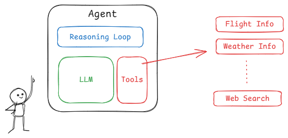

# Agents Aren’t Magic: The Real Architecture Behind Tool-Calling AI Systems



**TL;DR:** An “agent” is a system pattern built from a language model plus state, tools, and a control loop. The engineering work—safety, orchestration, observability—matters far more than prompt engineering alone.

## 1. Why Everyone Is Talking About Agents

The move from chatbots to agents is a shift from passive text-generation to active, tool-enabled systems that can take actions: call APIs, query databases, run code, or orchestrate other services. People imagine autonomous systems that 'just do the job'—but real agents are systems engineering projects, not magic prompts.

Agents are interesting because they: (a) let models interact with external systems, (b) enable multi-step workflows, and (c) separate decision-making (planning) from execution. Those benefits introduce software engineering challenges that are often glossed over in demos.

## 2. What Are AI Agents? (Architectural Overview)

At a high level an agent is composed of:

- **LLM (reasoner):** produces plans, selects tools, and interprets outputs.
- **Memory / state:** short and long-term context that persists across interactions.
- **Tools:** wrapped endpoints or functions the agent can call (search, DB, calculator, API).
- **Controller (core loop):** coordinates planning, tool calls, observation handling, and termination.

Key distinctions:

- Stateless vs stateful: a *stateless* agent treats each user prompt independently; a *stateful* agent maintains context (conversations, task progress, persistent knowledge).
- Single-step vs multi-step reasoning: single-step uses model output directly; multi-step iteratively plans, acts, observes, and replans.

## 3. The Core Loop: How Agents Actually Work

The simplest abstraction is Plan → Act → Observe → Repeat.

- Plan: the model suggests the next action(s) and which tool to use.
- Act: the system executes the chosen tool(s).
- Observe: the system returns the tool output to the model.
- Repeat: the model updates its plan based on observations until the task completes.

This loop defines where complexity emerges: error handling on tools, deciding when to stop, and managing state across steps.

### Minimal agent pseudocode

```python
def agent_loop(model, tools, memory, user_request):
	context = memory.load(user_request)
	while True:
		plan = model.plan(context)
		if plan.type == "finish":
			memory.save(context)
			return plan.result
		tool = tools.get(plan.tool_name)
		result = tool.call(plan.args)
		context.append_observation(result)

		# safety: bail out on repeated failures or policy block
		if context.error_count > MAX_RETRIES:
			return "I couldn't complete that task."
```

## 4. Tool Calling Patterns and Protocols

Tool calling is just an RPC (Remote Procedure Call) pattern with model-driven selection. Common patterns:

- **Direct function calling:** model returns structured JSON with a tool name and arguments. Your system validates and executes.
- **Planner–executor:** separate the planning model from an executor that can enforce constraints and retry logic.
- **Tool router / policy layer:** a middleware that decides which tool a model's request maps to (sometimes used to check permissions first).

Best practices:

- Always use a strict schema for model→tool messages and validate before execution.
- Keep tool outputs structured so the model can reason about them deterministically.
- Rate-limit and sandbox risky tools.

When not to use tools: if the cost or latency of calling tools outweighs the benefit; for high-frequency small queries, prefer embedding caches.

## 5. Orchestration: Planners, Executors, and Tool Wrappers

Orchestration flavors:

- **Single-agent monolith:** one model instance decides and calls tools directly—simple but harder to scale.
- **Planner + executor microservices:** planner produces a task graph; executor runs steps with retries, logging, and permissions.
- **Multi-agent teams:** specialized agents (searcher, summarizer, verifier) collaborate—useful for complex domains.

Task decomposition strategies:

- Break tasks into idempotent steps so retries are safe.
- Prefer explicit subtask boundaries and checkpoints for long-running flows.

Trade-offs: monoliths are fast to prototype; separate services are safer and easier to observe but add latency and complexity.

## 6. Safety, Sandboxing, and Permissioning

Tool calls introduce real-world side effects. Consider:

- **Guardrails:** validate model outputs against allowlists/deny-lists and ACLs before executing.
- **Sandboxes:** run untrusted actions in restricted environments, especially code execution.
- **Human-in-the-loop escalation:** for destructive actions, require confirmation or human approval.
- **Loop prevention:** detect and break cycles (e.g., the agent repeating the same failing step).

Design for the worst-case: assume the model will produce unexpected, adversarial, or plausible-sounding but wrong outputs.

## 7. Example Architectures (With Code Concepts)

Minimal production-ready patterns:

- **Tool registry:** a declarative list of tool adapters with metadata (name, schema, permission level, cost estimate).

- **Executor:** wraps tool calls with retries, timeouts, circuit-breakers, and structured logging.

- **Planner:** a model-facing service that returns structured actions and termination signals.

Example `tool` descriptor (YAML-like):

```yaml
name: search_docs
schema:
  query: string
  top_k: int
permission: read_docs
cost: low
```

Observability hooks to include:

- Input/output traces (redact secrets).
- Tool latency and error metrics.
- Plan vs actual execution logs for debugging model reasoning.

## 8. Production Considerations Nobody Mentions

- **Latency stacking:** every tool call adds milliseconds; pipelines with many calls add up—measure p99s, not just averages.
- **Cost explosion:** models plus external calls can be expensive. Cache tool outputs and batch operations where possible.
- **Versioning:** prompts, model versions, and tool contracts must be versioned to ensure reproducibility.
- **Observability:** store structured traces so you can replay executions for debugging and auditing.

Operational checklist:

- Monitor cost per completed task, not just per API call.
- Add circuit breakers for flaky external services.
- Keep synthetic tests that run typical agent flows end-to-end.

## 9. Common Design Mistakes

- **Over-engineering planners:** overly complex planners with heavy recursion are brittle. Start small.
- **Hidden state bugs:** ambiguous or implicit state leads to inconsistent behavior—use explicit schemas and checkpoints.
- **Blind trust in model decisions:** models are probabilistic; always verify before performing irreversible actions.

Simple rules to avoid mistakes:

- Make every action auditable and reversible when possible.
- Prefer small, testable steps.
- Keep tool interfaces explicit and schema-validated.

## 10. Final Thoughts: Agents as Systems, Not Prompts

Agents let us move from conversational demos to systems that actually perform work. But this power comes with engineering responsibility: robust orchestration, safety layers, observability, and lifecycle management.

If you’re building agents, treat them like distributed systems: define contracts, monitor behavior, and plan for failure modes. The model is a component—an important one—but not a substitute for sound system design.

---

# Image Credits and Disclaimer

Images in this article are hosted for educational clarity and sourced from publicly available materials. Exact original sources may not be individually identified. All images are used for non-commercial, educational purposes.

---

Let’s Connect
If you found this helpful, feel free to reach out:

💻 GitHub: https://github.com/Sahil0015
🔗 LinkedIn: https://www.linkedin.com/in/sahil-codes
📧 Email: sahilaggarwal1532003@gmail.com